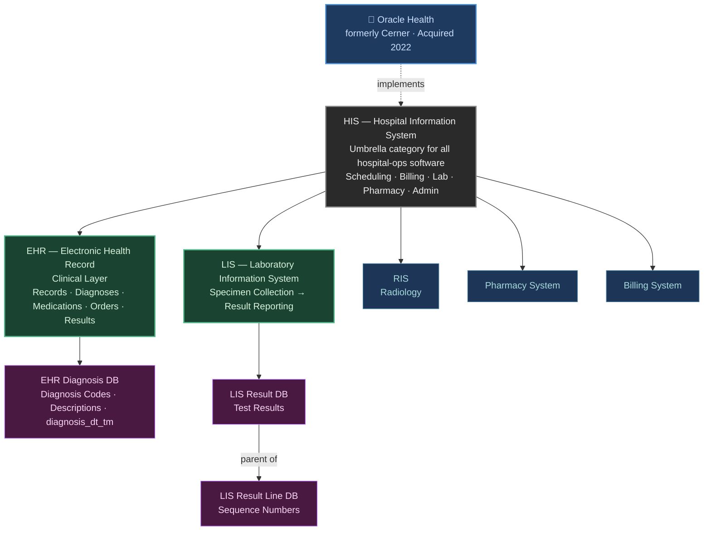

```mermaid
flowchart TD
    OH["🏢 Oracle Health\nformerly Cerner · Acquired 2022"]
    HIS["HIS — Hospital Information System\nUmbrella category for all hospital-ops software\nScheduling · Billing · Lab · Pharmacy · Admin"]

    OH -.->|implements| HIS

    EHR["EHR — Electronic Health Record\nClinical Layer\nRecords · Diagnoses · Medications · Orders · Results"]
    LIS["LIS — Laboratory Information System\nSpecimen Collection → Result Reporting"]
    RIS["RIS\nRadiology"]
    PHARM["Pharmacy System"]
    BILL["Billing System"]

    EHRDIAG["EHR Diagnosis DB\nDiagnosis Codes · Descriptions · diagnosis_dt_tm"]
    LISRESULT["LIS Result DB\nTest Results"]
    LISRESLINE["LIS Result Line DB\nSequence Numbers"]

    HIS --> EHR
    HIS --> LIS
    HIS --> RIS
    HIS --> PHARM
    HIS --> BILL

    EHR --> EHRDIAG
    LIS --> LISRESULT
    LISRESULT -->|parent of| LISRESLINE

    classDef vendor fill:#1e3a5f,color:#cce0ff,stroke:#4a90d9,stroke-width:2px
    classDef category fill:#2a2a2a,color:#eeeeee,stroke:#888888,stroke-width:2px
    classDef core fill:#1b4332,color:#d8f3dc,stroke:#52b788,stroke-width:2px
    classDef other fill:#1d3557,color:#a8dadc,stroke:#457b9d,stroke-width:1px
    classDef db fill:#4a1942,color:#f8d7f4,stroke:#c77dff,stroke-width:1px

    class OH vendor
    class HIS category
    class EHR,LIS core
    class RIS,PHARM,BILL other
    class EHRDIAG,LISRESULT,LISRESLINE db
```
